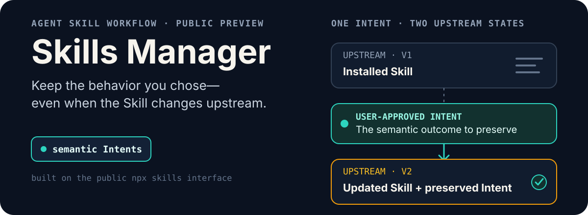
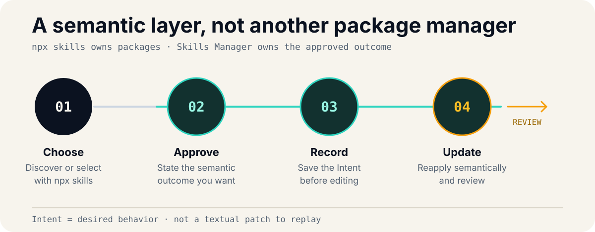

<p align="center">
  
</p>

Skills Manager manages Agent Skills through `npx skills` and preserves the behavior you approved when upstream content changes.

> [!IMPORTANT]
> `v0.1.0` is a **Public Preview**. The workflow and Intent format may change.

## Quick start

Supported runtimes: **Node.js 22 and 24** with **`npx skills >=1.5.19 <2.0.0`**.

```sh
npx skills add Flower-F/skills-manager
```

Start a new Agent session, then ask:

> Find Skills that can review accessibility in my frontend, explain the best candidates, and let me choose before installing anything.

## Core experience

<p align="center">
  
</p>

1. **Discover** — describe what you need; the Agent finds and explains relevant Skills.
2. **Install** — approve the exact Skill selection; `npx skills` handles scope, targets, security prompts, and installation.
3. **Customize** — describe the behavior you want; Skills Manager records it as an Intent before editing the installed Skill.
4. **Update** — ask to update; upstream content advances, then every active Intent is reapplied semantically and reviewed.

For example:

> Customize this Installation so it always checks migration notes, and save that outcome as an Intent.

Skills Manager records the desired result—not a brittle textual patch:

```markdown
---
source: owner/repository
skill: release-notes
scope: project
---

# Active Intents

- Always check migration notes before drafting release notes.
```

Later, “Update my installed Skills and preserve every active Intent” updates the upstream Skill and adapts the implementation while keeping that approved outcome. Any semantic change still requires your approval.

## Boundaries

- `npx skills` remains the sole package manager. Skills Manager adds recommendations, approvals, Intents, and semantic reapplication.
- Project and global Installations keep independent Intent documents.
- Local Skills have no tracked upstream Update or clean-upstream comparison.
- Distribution is GitHub-only; this project is not published as an npm package, and `npx skills` 2.x is unsupported during the preview.

> [!CAUTION]
> Customization patches are raw and **not automatically redacted**. They may expose private Skill content in terminal output, Agent conversations, or shared logs. Avoid storing credentials in Skills and review output before sharing it.

## Development and project docs

The implementation has no runtime dependencies or build step.

```sh
npm test
npm run typecheck
npm run check:distribution
```

[Contributing](CONTRIBUTING.md) · [Release notes](docs/releases/v0.1.0.md) · [Architecture decisions](docs/adr/README.md) · [Security](SECURITY.md) · [Support](SUPPORT.md) · [MIT License](LICENSE)
