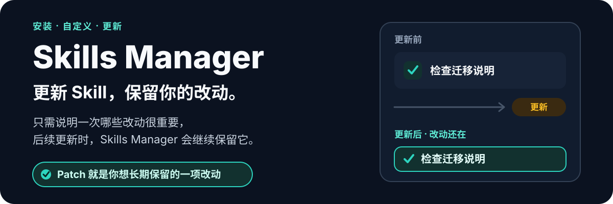
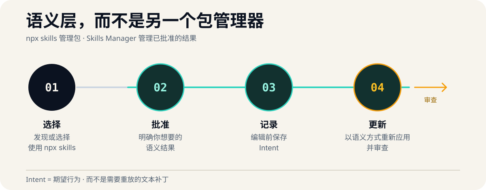

<p align="center">
  
</p>

<p align="center">
  <a href="./README.md">English</a> · <strong>简体中文</strong>
</p>

Skills Manager 通过 `npx skills` 管理 Agent Skills，并在上游内容发生变化时保留你已批准的行为。

> [!IMPORTANT]
> `v0.1.0` 是一个**公开预览版**，工作流和 Intent 格式可能会发生变化。

## 快速开始

支持的运行时：**Node.js 22 和 24**，以及 **`npx skills >=1.5.19 <2.0.0`**。

```sh
npx skills add Flower-F/skills-manager
```

启动一个新的 Agent 会话，然后提出需求：

> 查找能够审查前端无障碍性的 Skills，说明最合适的候选项，并在安装任何内容之前让我选择。

## 核心体验

<p align="center">
  
</p>

1. **发现**——描述你的需求；Agent 会查找并说明相关的 Skills。
2. **安装**——批准确切的 Skill 选择；`npx skills` 负责作用域、目标 Agent、安全提示和安装。
3. **自定义**——描述你想要的行为；Skills Manager 会先将其记录为 Intent，再编辑已安装的 Skill。
4. **更新**——发起更新请求；上游内容更新后，每个有效的 Intent 都会以语义化方式重新应用并接受审查。

例如：

> 自定义这个 Installation，让它始终检查迁移说明，并将这一结果保存为 Intent。

Skills Manager 记录的是期望结果，而不是脆弱的文本补丁：

```markdown
---
source: owner/repository
skill: release-notes
scope: project
---

# Active Intents

- Always check migration notes before drafting release notes.
```

之后，“更新我已安装的 Skills 并保留所有有效的 Intent”会更新上游 Skill，并在维持已批准结果的同时调整具体实现。任何语义变更仍然需要你的批准。

## Managed Update 如何工作

每次 Update 都先执行 **Update preflight**：在任何上游变更之前解析准确的 Installation，并验证对应的 Intent 文档。如果没有有效 Intent，上游包操作成功就是快速路径的完成条件，不会创建基线，也不会获取干净上游内容。

如果 Installation 有有效 Intent，Skills Manager 会在上游更新成功后捕获临时的 **Intent application baseline**，并返回短期有效的 **Baseline handle**。Agent 随后重新应用已批准的结果，把 **Intent application patch** 审查并转述为 **Intent application evidence**，逐一分类 Intent，最后关闭 handle。已经存在于该基线中的行为属于 **Baseline-satisfied Intent**，仍保持有效。只有在准备提出 **Upstream-fulfilled Intent** 时才会按需获取干净上游内容；在你确认删除之前，该 Intent 仍然具有权威性。

如果上游变更命令启动后失败、超时或被中断，Skills Manager 会报告 **Unknown mutation outcome**；任何恢复都必须从新的 preflight 开始，绝不会自动重试变更。批量 Update 按作用域共享公开列表读取，并按规范化来源共享可选的干净上游获取，同时保持每个 Installation 的结果和 Baseline handle 相互独立。

## 边界

- `npx skills` 始终是唯一的包管理器。Skills Manager 在此基础上提供推荐、批准、Intent 和语义化重新应用能力。
- 项目级和全局 Installation 分别维护独立的 Intent 文档。
- Local Skill 不支持受跟踪的上游 Update，也不支持与干净上游版本进行比较。
- 直接修改 Intent 时，会先捕获基线、再记录已批准的 Intent，随后修改已安装内容、审查本次应用并关闭 Baseline handle。移除 Intent 时，只有在已应用行为被移除并审查完成后，才删除有效结果。
- 已自定义的 Skills Manager 会在变更前拒绝 self-Update；未自定义的 self-Update 完成后会要求启动新的 Agent 会话。
- 本项目仅通过 GitHub 分发，不会发布为 npm 包；公开预览期间不支持 `npx skills` 2.x。

> [!CAUTION]
> Intent 应用补丁是原始内容，**不会自动脱敏**。它们可能会在终端输出、Agent 对话或共享日志中暴露私有 Skill 内容。请避免在 Skills 中存放凭据，并在分享前检查输出内容。

## 开发与项目文档

本项目的实现没有运行时依赖，也不需要构建步骤。

```sh
npm test
npm run typecheck
npm run check:distribution
```

[贡献指南](CONTRIBUTING.md) · [发布说明](docs/releases/v0.1.0.md) · [架构决策](docs/adr/README.md) · [安全策略](SECURITY.md) · [支持](SUPPORT.md) · [MIT 许可证](LICENSE)
